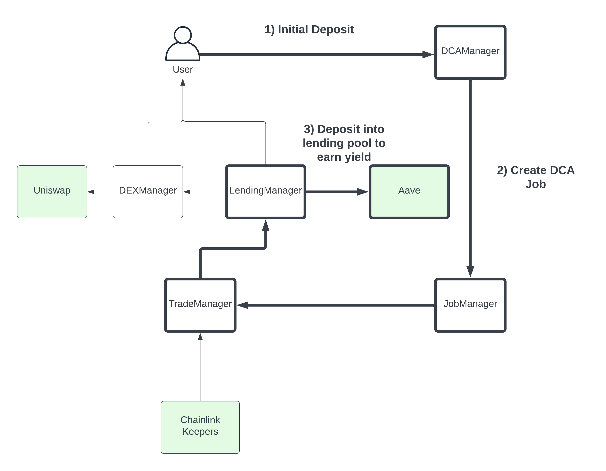
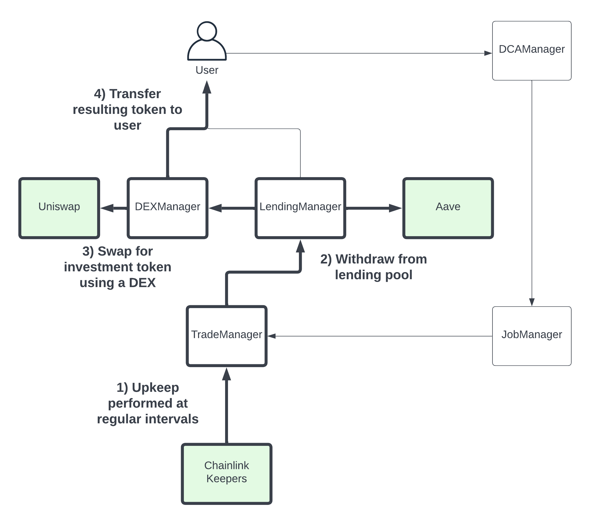
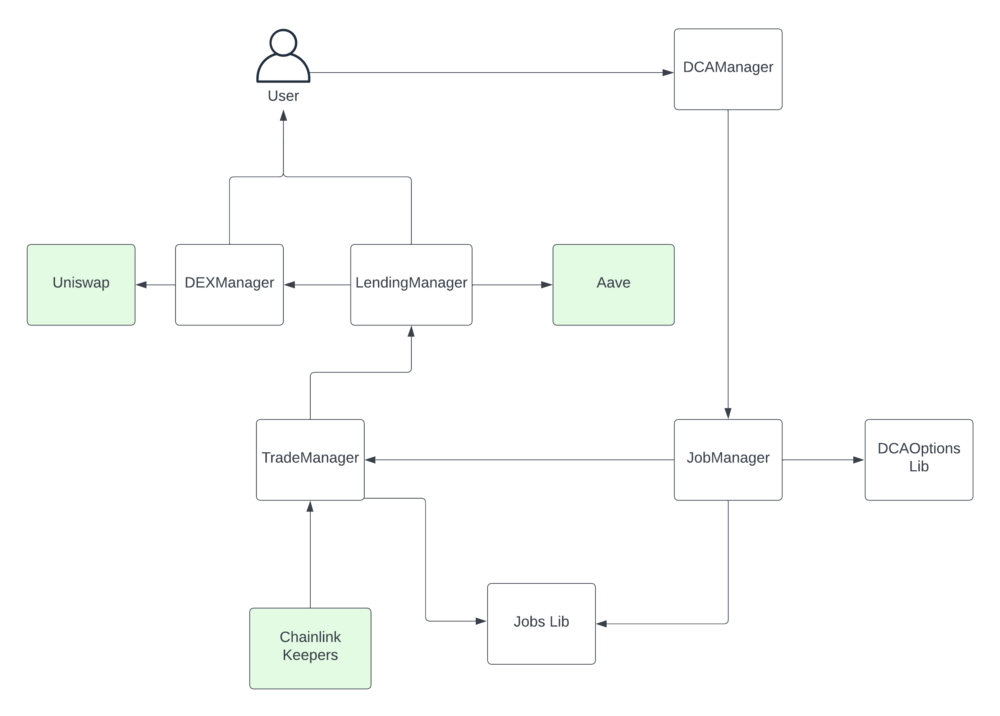

For the majority of crypto investors, it isn’t about degenerate day trading with 5x leverage. Or about flipping NFT poop emojis for profit. Instead, the commonly preferred method is the tried and true Dollar-Cost-Averaging - a simple, unemotional albeit boring approach.

Dollar-Cost-Averaging is the practice of purchasing the same amount of an underlying asset at regular intervals, regardless of its price. It is designed to lower the average cost per share and reduce volatility, which is especially important to onboarding the non-degenerates amongst us into crypto.

Drip Investor is a dapp that allows permissionless Dollar-Cost-Averaging of tokenized assets. Users can deposit stablecoins, which earn passive lending yield. During regular intervals, stablecoin tokens are withdrawn and swapped using decentralized exchanges to convert into investment tokens of choice.

Drip Investor is built via integrations with Aave, Uniswap, and Chainlink Keepers.

## Table of Contents

- [System Requirements](#system-requirements)
- [Quick Start](#quick-start)
  - [Initial Setup and Dependencies](#initial-setup-and-dependencies)
  - [Deploy Smart Contracts](#deploy-smart-contracts)
- [User Guide](#user-guide)
  - [Initial Deposit](#deposits)
  - [Dollar-Cost-Averaging](#dollar-cost-averaging-investments)
- [Smart Contract & Mechanics](#smart-contract--mechanics)
  - [Contract Deployment](#contract-deployment)
  - [Local Hardhat Node](#local-hardhat-node)
- [Testing](#testing)
- [Design Patterns](#design-patterns)
- [Further/Next Steps](#further--next-steps)

## System Requirements

- [Node](https://nodejs.org/en/download/) v16.14.0
- [Hardhat](https://hardhat.org/) v2.10.1
- [Hardhat-Waffle](https://www.npmjs.com/package/@nomiclabs/hardhat-waffle) v2.0.3

## Quick Start

### Initial Setup and Dependencies

On Terminal 1 clone this repository and install its dependencies:

```sh
$ git clone https://github.com/yan-man/Drip-Investor.git
$ cd Drip-Investor
$ npm install
```

### Testing

See [Hardhat](https://hardhat.org/tutorial/testing-contracts.html) for more details.

Navigate to root directory, then start tests.

```sh
$ npx hardhat test
```

For test coverage:

```sh
$ npx hardhat coverage
```

### Deploy Smart Contracts

On a new terminal (Terminal 3), go to the repository's root folder and run the script to deploy the collection of smart contracts and configure initial settings.

```sh
$ npx hardhat run scripts/deploy.js --network localhost
```

## User Guide

### Deposits

1. The user first deposits some amount of stablecoin into the dapp, specifying how much they would like to invest, what to invest in, and at what frequency of investment. For example, 1000 total USDC, investing 100 USDC per week on wrapped bitcoin.

   \*For this initial version, only weekly investments are allowed. Input stablecoins are configured to USDC and output tokens to WETH.

2. In the backend, this registers a DCA job internally that is configured to run during each time interval.

3. This initial balance is supplied to Aave lending pools, where it will earn passive lending yield.



### Dollar Cost Averaging Investments

1. At regular intervals (ie weekly), Chainlink Keepers are employed to help to execute the Dollar-Cost-Averaging investments by performing upkeep on our smart contract. It is essentially on-chain CRON jobs.

2. During each job, the investment amount, 100 USDC in our example, is withdrawn from the lending pool.

3. Then it is swapped for the desired investment token (ie wBTC) via Uniswap DEX. These investments occur periodically until either funds run out or users cancel their jobs.

4. Swapped tokens can be directly transferred to user, minimizing custodial risk.



## Smart Contract Architecture



### `DCAManager.sol`

The core contract interface for users to interact with. It manages the other helper contracts and has overall admin power. When creating or cancelling jobs, users should invoke functions from `DCAManager`.

### `JobManager.sol`

Manages user-created DCA job, which are represented by an investment amount, frequency, start date, and job owner. Also retrieves Job info as needed by other contracts.

### `TradeManager.sol`

Manages deposits and withdrawals from the initial supply deposit into the Lending protocol. This is the contract that will be registered with Chainlink Keepers.

### `LendingManager.sol`

Manages interactions with the external API for the lending protocol of choice; in this initial version, it is only via Aave.

### `DEXManager.sol`

Manages interactions with the external API for the DEX of choice; in this initial version, it is only via Uniswap.

## Libraries

### `DCAOptions.sol`

Library that manages the different DCA options which will be available - token type, DCA frequency, etc.

### `Jobs.sol`

Library that manages Job struct.

## Design Patterns

- separation of concerns
- libraries

## Further / Next Steps

- Front end: create a React based app that can integrate with the smart contracts via ethers.js, allowing users to save and cancel DCA jobs. Also show users their transaction history and net profits, using TheGraph to retrieve event data, etc.
- Access Control: Currently smart contract functions are not restricted, as they should be in production. There are complicated interactions between contracts that need to be resolved.

Expand functionality:

- cancel jobs: further develop UX and functionality for cancelled jobs.
- optionality: Currently the deposit token (USDC) and the investment token (wETH) are not flexible options, as well as the choice of DEX (Uniswap) or lending pool (Aave). We still need to resolve, from a UX perspective, how much optionality we want to give end users in these choices.

- Expand code coverage

## What's Included?

- [Hardhat](https://hardhat.org/): An Ethereum development task runner and testing network.
- [Mocha](https://mochajs.org/): A JavaScript test runner.
- [Chai](https://www.chaijs.com/): A JavaScript assertion library.
- [Waffle](https://github.com/EthWorks/Waffle/): To have Ethereum-specific Chai assertions/matchers.

## License

All non-boilerplate code is unlicensed. Yan Man 2022.
